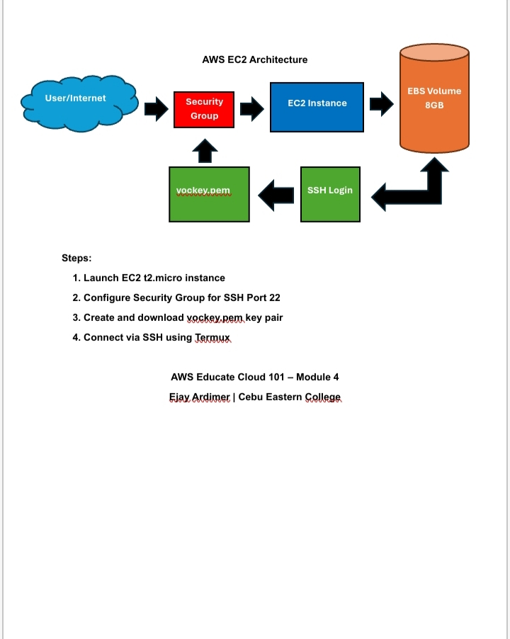

AWS Cloud 101 Projects
My hands-on labs from AWS Educate at Cebu Eastern College 🚀

Module 4: AWS Core Services

✅ S3 Static Website Hosting
Date: April 20, 2026  
Skills: Amazon S3, Cloud Architecture, GitHub, Technical Documentation

What I built:
- Designed S3 bucket architecture for static website hosting
- Configured bucket policy for public read access  
- Set up static website endpoint with index.html
- Documented cloud architecture for portfolio

**Architecture Diagram:**  
[📄 View S3 Static Website Architecture PDF](S3%20Static%20Website%20Hosting%20Architecture%20.pdf)

Key Learnings:
- S3 buckets can host static websites without EC2 servers
- Public access requires explicit bucket policy configuration
- Architecture diagrams communicate cloud solutions effectively

AWS EC2 Concepts | April 21, 2026
- Created EC2 architecture diagram showing SSH connection flow
- Documented 4-step process: Launch → Security Group → Key Pair → SSH
- Understood EC2 as virtual server with EBS storage
- Learned Security Group as firewall controlling Port 22 access

**Architecture Diagram:**

[Download PDF Version](EC2%20Architecture.pdf)

Key Learnings:
- EC2 is AWS virtual server in the cloud
- Security Groups act as virtual firewall for EC2
- Key Pair (.pem file) enables secure SSH access
- EBS provides persistent block storage for EC2

AWS Educate Cloud 101 - Module 4
Ejay Ardimer | Cebu Eastern College
